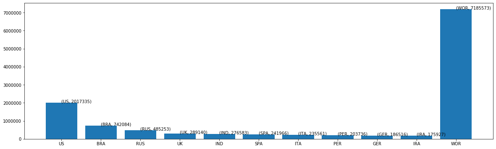
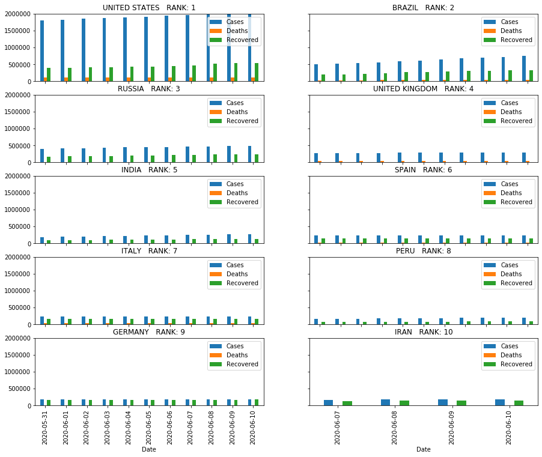
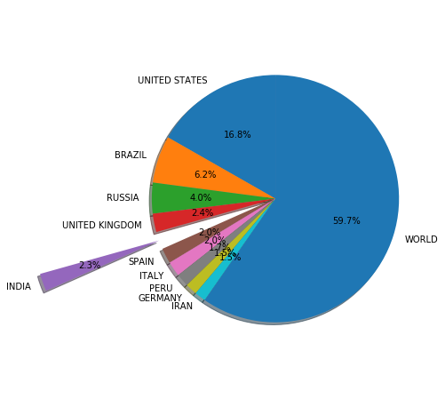

# Covid 19
<a id= "covid19"></a>


```python
import pandas as pd
from bs4 import BeautifulSoup
from urllib.request import Request, urlopen
import re
import math
from datetime import date
import csv
import warnings
warnings.filterwarnings("ignore")
```


```python
url="https://en.wikipedia.org/wiki/Template:COVID-19_pandemic_data"
html=urlopen(url)

soup=BeautifulSoup(html,'lxml')
```


```python
table = soup.find_all('tbody')
```


```python
rows=soup.find_all('tr')
```


```python
a=[]
for row in rows:
    row_td=row.find_all("td")
    str_cells=str(row_td)
    cleantext=BeautifulSoup(str_cells,"lxml").get_text()
    a.append(cleantext[1:-1].split(', '))
```


```python
a=a[2:230]
```


```python
a
```


    [['2,017,335\n', '113,517\n', '541,116\n', '[9]\n'],
     ['742,084\n', '38,497\n', '325,602\n', '[13][14]\n'],
     ['485,253\n', '6,142\n', '242,397\n', '[15]\n'],
     ['289,140\n', '40,883\n', 'No data\n', '[17][18]\n'],
     ['276,583\n', '7,745\n', '135,206\n', '[19]\n'],
     ['241,966\n', '27,136\n', '150,376\n', '[20]\n'],
     ['235,561\n', '34,043\n', '168,646\n', '[21][22]\n'],
     ['203,736\n', '5,738\n', '92,929\n', '[23][24]\n'],
     ['186,516\n', '8,831\n', '170,134\n', '[26][25]\n'],
     ['175,927\n', '8,425\n', '138,457\n', '[27]\n'],
     ['172,114\n', '4,729\n', '144,598\n', '[28]\n'],
     ['154,591\n', '29,296\n', '71,506\n', '[29]\n'],
     ['142,759\n', '2,283\n', 'No data\n', '[30]\n'],
     ['124,301\n', '14,649\n', '91,412\n', '[31][32]\n'],
     ['113,702\n', '2,255\n', '36,308\n', '[33]\n'],
     ['108,571\n', '783\n', '76,339\n', '[34]\n'],
     ['96,653\n', '7,897\n', '55,571\n', '[35]\n'],
     ['83,046\n', '4,634\n', '78,357\n', '[36]\n'],
     ['70,879\n', '62\n', '47,569\n', '[37]\n'],
     ['71,675\n', '975\n', '15,336\n', '[38]\n'],
     ['59,437\n', '9,619\n', '16,324\n', '[40]\n'],
     ['52,991\n', '1,162\n', '29,006\n', '[41]\n'],
     ['50,265\n', '282\n', '24,506\n', '[42]\n'],
     ['47,903\n', '6,031\n', 'No data\n', '[44]\n'],
     ['45,924\n', '4,717\n', 'No data\n', '[45][46]\n'],
     ['43,917\n', '3,690\n', '4,375\n', '[47]\n'],
     ['42,078\n', '1,372\n', '16,534\n', '[48]\n'],
     ['39,904\n', '283\n', '22,740\n', '[49]\n'],
     ['38,514\n', '25\n', '25,877\n', '[50][51]\n'],
     ['36,829\n', '1,306\n', '9,786\n', '[52]\n'],
     ['35,306\n', '1,492\n', '21,339\n', '[53]\n'],
     ['33,140\n', '273\n', '22,162\n', '[54]\n'],
     ['33,076\n', '1,923\n', '11,414\n', '[55]\n'],
     ['30,988\n', '1,663\n', '28,700\n', '[56][57]\n'],
     ['27,856\n', '810\n', '12,412\n', '[58]\n'],
     ['27,560\n', '1,183\n', '13,196\n', '[45][59]\n'],
     ['25,215\n', '1,691\n', '22,698\n', '[60][61]\n'],
     ['24,748\n', '717\n', '7,555\n', '[63]\n'],
     ['22,992\n', '1,017\n', '4,736\n', '[64][65]\n'],
     ['21,459\n', '384\n', '2,651\n', '[66]\n'],
     ['20,749\n', '1,345\n', '14,910\n', '[67]\n'],
     ['20,415\n', '544\n', '12,208\n', '[68]\n'],
     ['18,198\n', '83\n', '4,152\n', '[69]\n'],
     ['18,089\n', '298\n', '15,137\n', '[70]\n'],
     ['17,210\n', '916\n', '15,213\n', '[71][72]\n'],
     ['16,979\n', '672\n', '15,875\n', '[73]\n'],
     ['16,854\n', '398\n', '10,401\n', '[74]\n'],
     ['15,731\n', '29\n', '10,606\n', '[75]\n'],
     ['14,268\n', '392\n', '5,831\n', '[76]\n'],
     ['13,949\n', '475\n', '2,159\n', '[77]\n'],
     ['13,675\n', '217\n', '4,451\n', '[78]\n'],
     ['13,464\n', '365\n', '4,206\n', '[79]\n'],
     ['13,074\n', '58\n', '8,015\n', '[80]\n'],
     ['12,001\n', '593\n', '10,849\n', '[81]\n'],
     ['11,965\n', '250\n', '11,348\n', '[82]\n'],
     ['11,902\n', '276\n', '10,611\n', '[83]\n'],
     ['10,382\n', '724\n', '6,951\n', '[84][85]\n'],
     ['10,201\n', '48\n', '3,755\n', '[86]\n'],
     ['10,025\n', '365\n', '5,797\n', '[87]\n'],
     ['9,751\n', '328\n', '7,053\n', '[88]\n'],
     ['8,576\n', '239\n', '8,138\n', '[91]\n'],
     ['8,437\n', '210\n', '7,493\n', '[93]\n'],
     ['8,336\n', '117\n', '6,975\n', '[94]\n'],
     ['8,312\n', '208\n', '4,794\n', '[95][96]\n'],
     ['8,191\n', '98\n', '4,606\n', '[97]\n'],
     ['7,502\n', '267\n', '1,323\n', '[98]\n'],
     ['7,265\n', '102\n', '6,720\n', '[99]\n'],
     ['7,025\n', '324\n', '5,800\n', '[100]\n'],
     ['6,450\n', '262\n', '740\n', '[102]\n'],
     ['6,427\n', '389\n', '2,127\n', '[103]\n'],
     ['5,185\n', '142\n', '850\n', '[104][9]\n'],
     ['4,690\n', '48\n', '2,815\n', '[105]\n'],
     ['4,520\n', '18\n', '3,459\n', '[106]\n'],
     ['4,516\n', '51\n', '2,809\n', '[107]\n'],
     ['4,331\n', '314\n', '2,139\n', '[108]\n'],
     ['4,259\n', '90\n', '539\n', '[109]\n'],
     ['4,258\n', '23\n', '2,942\n', '[110]\n'],
     ['4,085\n', '15\n', '584\n', '[111][112]\n'],
     ['4,046\n', '110\n', '3,901\n', '[113]\n'],
     ['4,017\n', '550\n', '2,324\n', '[114]\n'],
     ['3,995\n', '38\n', '2,045\n', '[115]\n'],
     ['3,538\n', '54\n', '24\n', '[116]\n'],
     ['3,294\n', '21\n', '956\n', '[117]\n'],
     ['3,239\n', '157\n', '1,658\n', '[118]\n'],
     ['3,191\n', '58\n', '1,413\n', '[119]\n'],
     ['3,121\n', '58\n', '2,973\n', '[120]\n'],
     ['3,058\n', '183\n', '1,374\n', '[121]\n'],
     ['2,898\n', '88\n', '873\n', '[122]\n'],
     ['2,810\n', '164\n', '1,587\n', '[123]\n'],
     ['2,728\n', '160\n', '2,049\n', '[124]\n'],
     ['2,632\n', '23\n', '487\n', '[125]\n'],
     ['2,416\n', '85\n', '489\n', '[126]\n'],
     ['2,336\n', '32\n', '379\n', '[127]\n'],
     ['2,247\n', '106\n', '2,130\n', '[128]\n'],
     ['2,205\n', '83\n', '1,880\n', '[129]\n'],
     ['2,055\n', '24\n', '1,483\n', '[130]\n'],
     ['1,947\n', '69\n', '1,684\n', '[131]\n'],
     ['1,942\n', '8\n', '1,010\n', '[132]\n'],
     ['1,859\n', '11\n', '1,057\n', '[133]\n'],
     ['1,850\n', '5\n', '38\n', '[134]\n'],
     ['1,807\n', '10\n', '1,794\n', '[135]\n'],
     ['1,727\n', '72\n', '1,338\n', '[136]\n'],
     ['1,604\n', '19\n', '15\n', '[137][138]\n'],
     ['1,586\n', '94\n', '931\n', '[139]\n'],
     ['1,531\n', '28\n', '1,402\n', '[140]\n'],
     ['1,486\n', '109\n', '1,359\n', '[141][142]\n'],
     ['1,464\n', '55\n', '370\n', '[45][143]\n'],
     ['1,389\n', '12\n', '153\n', '[144]\n'],
     ['1,375\n', '11\n', '717\n', '[145]\n'],
     ['1,368\n', '30\n', '795\n', '[146]\n'],
     ['1,306\n', '12\n', '200\n', '[147]\n'],
     ['1,299\n', '34\n', '960\n', '[148]\n'],
     ['1,263\n', '31\n', '912\n', '[149]\n'],
     ['1,200\n', '10\n', '912\n', '[150]\n'],
     ['1,187\n', '11\n', '604\n', '[151]\n'],
     ['1,162\n', '61\n', '139\n', '[152]\n'],
     ['1,154\n', '22\n', '1,132\n', '[153]\n'],
     ['1,138\n', '9\n', '274\n', '[154]\n'],
     ['1,108\n', '4\n', '1,049\n', '[155]\n'],
     ['1,102\n', '1\n', '53\n', '[156]\n'],
     ['1,089\n', '26\n', '794\n', '[45][157]\n'],
     ['1,087\n', '49\n', '982\n', '[158]\n'],
     ['1,081\n', '0\n', '0\n', '[159]\n'],
     ['1,025\n', '50\n', '621\n', '[163][164]\n'],
     ['974\n', '65\n', '871\n', '[165]\n'],
     ['972\n', '18\n', '807\n', '[166]\n'],
     ['891\n', '53\n', '765\n', '[167][168]\n'],
     ['852\n', '51\n', '751\n', '[169]\n'],
     ['846\n', '23\n', '754\n', '[170]\n'],
     ['845\n', '9\n', '657\n', '[171]\n'],
     ['844\n', '71\n', '706\n', '[172]\n'],
     ['818\n', '13\n', '686\n', '[173]\n'],
     ['728\n', '24\n', '221\n', '[174][175]\n'],
     ['718\n', '28\n', '169\n', '[176]\n'],
     ['712\n', '14\n', '653\n', '[71][177]\n'],
     ['688\n', '42\n', '483\n', '[178]\n'],
     ['657\n', '0\n', '118\n', '[179][180]\n'],
     ['632\n', '9\n', '597\n', '[181]\n'],
     ['599\n', '10\n', '405\n', '[182]\n'],
     ['585\n', '5\n', '270\n', '[183]\n'],
     ['524\n', '127\n', '23\n', '[184]\n'],
     ['514\n', '12\n', '76\n', '[185]\n'],
     ['509\n', '21\n', '183\n', '[186][187]\n'],
     ['501\n', '13\n', '260\n', '[188]\n'],
     ['481\n', '3\n', '404\n', '[189]\n'],
     ['463\n', '2\n', '300\n', '[190][191]\n'],
     ['455\n', '4\n', '55\n', '[192]\n'],
     ['453\n', '2\n', '136\n', '[193]\n'],
     ['443\n', '7\n', '430\n', '[195]\n'],
     ['430\n', '24\n', '64\n', '[196]\n'],
     ['429\n', '9\n', '357\n', '[197]\n'],
     ['383\n', '31\n', '199\n', '[198]\n'],
     ['371\n', '3\n', '232\n', '[199]\n'],
     ['359\n', '5\n', '58\n', '[200]\n'],
     ['337\n', '10\n', '324\n', '[201]\n'],
     ['336\n', '24\n', '312\n', '[202]\n'],
     ['332\n', '0\n', '316\n', '[203]\n'],
     ['324\n', '9\n', '315\n', '[204]\n'],
     ['314\n', '4\n', '46\n', '[205][206]\n'],
     ['312\n', '30\n', '290\n', '[207]\n'],
     ['305\n', '4\n', '188\n', '[208]\n'],
     ['252\n', '13\n', '238\n', '[209]\n'],
     ['246\n', '6\n', '159\n', '[210]\n'],
     ['194\n', '0\n', '75\n', '[211]\n'],
     ['187\n', '0\n', '187\n', '[212]\n'],
     ['180\n', '5\n', '163\n', '[9][213]\n'],
     ['176\n', '0\n', '164\n', '[214]\n'],
     ['176\n', '1\n', '104\n', '[215]\n'],
     ['156\n', '12\n', '86\n', '[216]\n'],
     ['148\n', '0\n', '0\n', '[217]\n'],
     ['146\n', '6\n', '62\n', '[218]\n'],
     ['141\n', '9\n', '114\n', '[219]\n'],
     ['141\n', '2\n', '138\n', '[220][221]\n'],
     ['141\n', '2\n', '67\n', '[222]\n'],
     ['137\n', '2\n', '9\n', '[223]\n'],
     ['128\n', '1\n', 'No data\n', '[224][225]\n'],
     ['126\n', '0\n', '125\n', '[226][227]\n'],
     ['117\n', '8\n', '108\n', '[228]\n'],
     ['108\n', '4\n', '104\n', '[229]\n'],
     ['103\n', '11\n', '62\n', '[230]\n'],
     ['101\n', '3\n', '98\n', '[231]\n'],
     ['99\n', '4\n', '93\n', '[232]\n'],
     ['96\n', '4\n', '38\n', '[233]\n'],
     ['92\n', '7\n', '81\n', '[234]\n'],
     ['83\n', '1\n', '45\n', '[235]\n'],
     ['82\n', '1\n', '55\n', '[236][237]\n'],
     ['77\n', '15\n', '61\n', '[238]\n'],
     ['71\n', '6\n', '62\n', '[239]\n'],
     ['60\n', '0\n', '60\n', '[240]\n'],
     ['59\n', '0\n', '17\n', '[241]\n'],
     ['57\n', '0\n', '31\n', '[242]\n'],
     ['57\n', '0\n', '31\n', '[242]\n'],
     ['45\n', '0\n', '45\n', '[243]\n'],
     ['42\n', '1\n', '24\n', '[244]\n'],
     ['39\n', '0\n', '39\n', '[245]\n'],
     ['35\n', '1\n', '27\n', '[242]\n'],
     ['31\n', '0\n', '16\n', '[246]\n'],
     ['30\n', '2\n', '19\n', '[247]\n'],
     ['28\n', '1\n', '21\n', '[248]\n'],
     ['27\n', '0\n', '16\n', '[249][250]\n'],
     ['26\n', '3\n', '20\n', '[251][252]\n'],
     ['24\n', '0\n', '24\n', '[253]\n'],
     ['23\n', '0\n', '22\n', '[254][255]\n'],
     ['21\n', '1\n', '16\n', '[256]\n'],
     ['21\n', '0\n', '20\n', '[257]\n'],
     ['20\n', '2\n', '16\n', '[258]\n'],
     ['19\n', '0\n', '19\n', '[259]\n'],
     ['19\n', '0\n', '18\n', '[260][261]\n'],
     ['18\n', '0\n', '18\n', '[262]\n'],
     ['18\n', '0\n', '16\n', '[263]\n'],
     ['15\n', '0\n', '15\n', '[264]\n'],
     ['13\n', '0\n', '13\n', '[265]\n'],
     ['13\n', '0\n', '13\n', '[266]\n'],
     ['13\n', '4\n', 'No data\n', '[269][270]\n'],
     ['12\n', '2\n', 'No data\n', '[272]\n'],
     ['12\n', '1\n', '10\n', '[273]\n'],
     ['12\n', '0\n', '12\n', '[274]\n'],
     ['11\n', '1\n', '10\n', '[275]\n'],
     ['11\n', '0\n', '11\n', '[276]\n'],
     ['8\n', '1\n', '7\n', '[277]\n'],
     ['8\n', '0\n', 'No data\n', '[278]\n'],
     ['8\n', '0\n', '8\n', '[281]\n'],
     ['4\n', '0\n', '2\n', '[282]\n'],
     ['3\n', '0\n', '3\n', '[283]\n'],
     ['3\n', '0\n', '3\n', '[284]\n'],
     ['2\n', '0\n', '2\n', '[285]\n'],
     ['2\n', '0\n', '2\n', '[286]\n'],
     ['1\n', '0\n', '1\n', '[287]\n']]


```python
for i in range(len(a)):
    a[i].pop()
    for j in range(len(a[i])):
        a[i][j]=a[i][j].rstrip("\n")
        if (a[i][j]=='No data'):
            a[i][j]=None
        else:
            a[i][j]=int(a[i][j].replace(",",""))
```


```python
a
```


    [[2017335, 113517, 541116],
     [742084, 38497, 325602],
     [485253, 6142, 242397],
     [289140, 40883, None],
     [276583, 7745, 135206],
     [241966, 27136, 150376],
     [235561, 34043, 168646],
     [203736, 5738, 92929],
     [186516, 8831, 170134],
     [175927, 8425, 138457],
     [172114, 4729, 144598],
     [154591, 29296, 71506],
     [142759, 2283, None],
     [124301, 14649, 91412],
     [113702, 2255, 36308],
     [108571, 783, 76339],
     [96653, 7897, 55571],
     [83046, 4634, 78357],
     [70879, 62, 47569],
     [71675, 975, 15336],
     [59437, 9619, 16324],
     [52991, 1162, 29006],
     [50265, 282, 24506],
     [47903, 6031, None],
     [45924, 4717, None],
     [43917, 3690, 4375],
     [42078, 1372, 16534],
     [39904, 283, 22740],
     [38514, 25, 25877],
     [36829, 1306, 9786],
     [35306, 1492, 21339],
     [33140, 273, 22162],
     [33076, 1923, 11414],
     [30988, 1663, 28700],
     [27856, 810, 12412],
     [27560, 1183, 13196],
     [25215, 1691, 22698],
     [24748, 717, 7555],
     [22992, 1017, 4736],
     [21459, 384, 2651],
     [20749, 1345, 14910],
     [20415, 544, 12208],
     [18198, 83, 4152],
     [18089, 298, 15137],
     [17210, 916, 15213],
     [16979, 672, 15875],
     [16854, 398, 10401],
     [15731, 29, 10606],
     [14268, 392, 5831],
     [13949, 475, 2159],
     [13675, 217, 4451],
     [13464, 365, 4206],
     [13074, 58, 8015],
     [12001, 593, 10849],
     [11965, 250, 11348],
     [11902, 276, 10611],
     [10382, 724, 6951],
     [10201, 48, 3755],
     [10025, 365, 5797],
     [9751, 328, 7053],
     [8576, 239, 8138],
     [8437, 210, 7493],
     [8336, 117, 6975],
     [8312, 208, 4794],
     [8191, 98, 4606],
     [7502, 267, 1323],
     [7265, 102, 6720],
     [7025, 324, 5800],
     [6450, 262, 740],
     [6427, 389, 2127],
     [5185, 142, 850],
     [4690, 48, 2815],
     [4520, 18, 3459],
     [4516, 51, 2809],
     [4331, 314, 2139],
     [4259, 90, 539],
     [4258, 23, 2942],
     [4085, 15, 584],
     [4046, 110, 3901],
     [4017, 550, 2324],
     [3995, 38, 2045],
     [3538, 54, 24],
     [3294, 21, 956],
     [3239, 157, 1658],
     [3191, 58, 1413],
     [3121, 58, 2973],
     [3058, 183, 1374],
     [2898, 88, 873],
     [2810, 164, 1587],
     [2728, 160, 2049],
     [2632, 23, 487],
     [2416, 85, 489],
     [2336, 32, 379],
     [2247, 106, 2130],
     [2205, 83, 1880],
     [2055, 24, 1483],
     [1947, 69, 1684],
     [1942, 8, 1010],
     [1859, 11, 1057],
     [1850, 5, 38],
     [1807, 10, 1794],
     [1727, 72, 1338],
     [1604, 19, 15],
     [1586, 94, 931],
     [1531, 28, 1402],
     [1486, 109, 1359],
     [1464, 55, 370],
     [1389, 12, 153],
     [1375, 11, 717],
     [1368, 30, 795],
     [1306, 12, 200],
     [1299, 34, 960],
     [1263, 31, 912],
     [1200, 10, 912],
     [1187, 11, 604],
     [1162, 61, 139],
     [1154, 22, 1132],
     [1138, 9, 274],
     [1108, 4, 1049],
     [1102, 1, 53],
     [1089, 26, 794],
     [1087, 49, 982],
     [1081, 0, 0],
     [1025, 50, 621],
     [974, 65, 871],
     [972, 18, 807],
     [891, 53, 765],
     [852, 51, 751],
     [846, 23, 754],
     [845, 9, 657],
     [844, 71, 706],
     [818, 13, 686],
     [728, 24, 221],
     [718, 28, 169],
     [712, 14, 653],
     [688, 42, 483],
     [657, 0, 118],
     [632, 9, 597],
     [599, 10, 405],
     [585, 5, 270],
     [524, 127, 23],
     [514, 12, 76],
     [509, 21, 183],
     [501, 13, 260],
     [481, 3, 404],
     [463, 2, 300],
     [455, 4, 55],
     [453, 2, 136],
     [443, 7, 430],
     [430, 24, 64],
     [429, 9, 357],
     [383, 31, 199],
     [371, 3, 232],
     [359, 5, 58],
     [337, 10, 324],
     [336, 24, 312],
     [332, 0, 316],
     [324, 9, 315],
     [314, 4, 46],
     [312, 30, 290],
     [305, 4, 188],
     [252, 13, 238],
     [246, 6, 159],
     [194, 0, 75],
     [187, 0, 187],
     [180, 5, 163],
     [176, 0, 164],
     [176, 1, 104],
     [156, 12, 86],
     [148, 0, 0],
     [146, 6, 62],
     [141, 9, 114],
     [141, 2, 138],
     [141, 2, 67],
     [137, 2, 9],
     [128, 1, None],
     [126, 0, 125],
     [117, 8, 108],
     [108, 4, 104],
     [103, 11, 62],
     [101, 3, 98],
     [99, 4, 93],
     [96, 4, 38],
     [92, 7, 81],
     [83, 1, 45],
     [82, 1, 55],
     [77, 15, 61],
     [71, 6, 62],
     [60, 0, 60],
     [59, 0, 17],
     [57, 0, 31],
     [57, 0, 31],
     [45, 0, 45],
     [42, 1, 24],
     [39, 0, 39],
     [35, 1, 27],
     [31, 0, 16],
     [30, 2, 19],
     [28, 1, 21],
     [27, 0, 16],
     [26, 3, 20],
     [24, 0, 24],
     [23, 0, 22],
     [21, 1, 16],
     [21, 0, 20],
     [20, 2, 16],
     [19, 0, 19],
     [19, 0, 18],
     [18, 0, 18],
     [18, 0, 16],
     [15, 0, 15],
     [13, 0, 13],
     [13, 0, 13],
     [13, 4, None],
     [12, 2, None],
     [12, 1, 10],
     [12, 0, 12],
     [11, 1, 10],
     [11, 0, 11],
     [8, 1, 7],
     [8, 0, None],
     [8, 0, 8],
     [4, 0, 2],
     [3, 0, 3],
     [3, 0, 3],
     [2, 0, 2],
     [2, 0, 2],
     [1, 0, 1]]


```python
df = pd.DataFrame(a)
```


```python
country_list=[]
for row in rows:
    row_th=row.find_all("th")
    str_cells=str(row_th)
    country=BeautifulSoup(str_cells,"lxml").get_text()
    country_list.append(country)

country_list
```


    ['[Location[a]\n, Cases[b]\n, Deaths[c]\n, Recov.[d]\n, Ref.\n]',
     '[Worldwide\n, 7,185,573\n, 408,954\n, 3,352,665\n, [2]\n]',
     '[\n, United States[e]\n]',
     '[\n, Brazil[f]\n]',
     '[\n, Russia[g]\n]',
     '[\n, United Kingdom[h]\n]',
     '[\n, India\n]',
     '[\n, Spain[i]\n]',
     '[\n, Italy\n]',
     '[\n, Peru\n]',
     '[\n, Germany[j]\n]',
     '[\n, Iran\n]',
     '[\n, Turkey\n]',
     '[\n, France[k]\n]',
     '[\n, Chile[l]\n]',
     '[\n, Mexico\n]',
     '[\n, Pakistan\n]',
     '[\n, Saudi Arabia\n]',
     '[\n, Canada\n]',
     '[\n, China[m]\n]',
     '[\n, Qatar\n]',
     '[\n, Bangladesh\n]',
     '[\n, Belgium[n]\n]',
     '[\n, South Africa\n]',
     '[\n, Belarus\n]',
     '[\n, Netherlands[o]\n]',
     '[\n, Sweden\n]',
     '[\n, Ecuador\n]',
     '[\n, Colombia\n]',
     '[\n, United Arab Emirates\n]',
     '[\n, Singapore\n]',
     '[\n, Egypt[p]\n]',
     '[\n, Portugal\n]',
     '[\n, Kuwait\n]',
     '[\n, Indonesia\n]',
     '[\n, Switzerland\n]',
     '[\n, Ukraine[q]\n]',
     '[\n, Poland\n]',
     '[\n, Ireland\n]',
     '[\n, Argentina[r]\n]',
     '[\n, Philippines\n]',
     '[\n, Afghanistan\n]',
     '[\n, Romania\n]',
     '[\n, Dominican Republic\n]',
     '[\n, Oman\n]',
     '[\n, Israel[s]\n]',
     '[\n, Japan[t]\n]',
     '[\n, Austria\n]',
     '[\n, Panama\n]',
     '[\n, Bahrain\n]',
     '[\n, Iraq\n]',
     '[\n, Bolivia\n]',
     '[\n, Armenia\n]',
     '[\n, Nigeria\n]',
     '[\n, Kazakhstan\n]',
     '[\n, Denmark[u]\n]',
     '[\n, Serbia[v]\n]',
     '[\n, South Korea\n]',
     '[\n, Algeria\n]',
     '[\n, Ghana\n]',
     '[\n, Moldova[w]\n]',
     '[\n, Czech Republic\n]',
     '[\n, Norway[x]\n]',
     '[\n, Morocco[y]\n]',
     '[\n, Malaysia\n]',
     '[\n, Cameroon\n]',
     '[\n, Azerbaijan[z]\n]',
     '[\n, Guatemala\n]',
     '[\n, Australia[aa]\n]',
     '[\n, Finland[ab]\n]',
     '[\n, Honduras\n]',
     '[\n, Sudan\n]',
     '[\n, Puerto Rico\n]',
     '[\n, Tajikistan\n]',
     '[\n, Uzbekistan\n]',
     '[\n, Senegal\n]',
     '[\n, Djibouti\n]',
     '[\n, DR Congo[ac]\n]',
     '[\n, Guinea\n]',
     '[\n, Nepal\n]',
     '[\n, Luxembourg\n]',
     '[\n, Hungary\n]',
     '[\n, Ivory Coast\n]',
     '[\n, Haiti\n]',
     '[\n, Gabon\n]',
     '[\n, North Macedonia\n]',
     '[\n, El Salvador\n]',
     '[\n, Thailand\n]',
     '[\n, Greece\n]',
     '[\n, Kenya\n]',
     '[\n, Bulgaria\n]',
     '[\n, Bosnia & Herzegovina\n]',
     '[\n, Venezuela\n]',
     '[\n, Somalia[ad]\n]',
     '[\n, Ethiopia\n]',
     '[\n, Croatia\n]',
     '[\n, Cuba[ae]\n]',
     '[\n, Kyrgyzstan\n]',
     '[\n, Estonia\n]',
     '[\n, Maldives\n]',
     '[\n, Sri Lanka\n]',
     '[\n, Central African Republic\n]',
     '[\n, Iceland\n]',
     '[\n, Lithuania\n]',
     '[\n, South Sudan\n]',
     '[\n, Mali\n]',
     '[\n, Slovakia\n]',
     '[\n, Slovenia\n]',
     '[\n, Nicaragua\n]',
     '[\n, Guinea-Bissau\n]',
     '[\n, Costa Rica\n]',
     '[\n, Lebanon\n]',
     '[\n, Equatorial Guinea\n]',
     '[\n, Albania\n]',
     '[\n, Kosovo\n]',
     '[\n, Zambia\n]',
     '[\n, Paraguay\n]',
     '[\n, Mauritania\n]',
     '[\n, New Zealand[af]\n]',
     '[\n, Madagascar\n]',
     '[\n, Hong Kong\n]',
     '[\n, USS Theodore Roosevelt[ag]\n]',
     '[\n, Latvia\n]',
     '[\n, Tunisia\n]',
     '[\n, Charles de Gaulle[ah]\n]',
     '[\n, Sierra Leone\n]',
     '[\n, Niger\n]',
     '[\n, Cyprus[ai]\n]',
     '[\n, Burkina Faso\n]',
     '[\n, Andorra\n]',
     '[\n, Uruguay[aj]\n]',
     '[\n, Jordan\n]',
     '[\n, Chad\n]',
     '[\n, Georgia[ak]\n]',
     '[\n, Congo[al]\n]',
     '[\n, Donetsk PR[am]\n]',
     '[\n, Diamond Princess[t]\n]',
     '[\n, San Marino\n]',
     '[\n, Uganda\n]',
     '[\n, Malta\n]',
     '[\n, Jamaica\n]',
     '[\n, Cape Verde\n]',
     '[\n, Yemen\n]',
     '[\n, São Tomé & Príncipe\n]',
     '[\n, Tanzania\n]',
     '[\n, Togo\n]',
     '[\n, Palestine\n]',
     '[\n, Rwanda\n]',
     '[\n, Malawi\n]',
     '[\n, Mozambique\n]',
     '[\n, Taiwan[an]\n]',
     '[\n, Somaliland[ao]\n]',
     '[\n, Luhansk PR[am]\n]',
     '[\n, Liberia\n]',
     '[\n, Eswatini\n]',
     '[\n, Libya\n]',
     '[\n, Mauritius\n]',
     '[\n, Isle of Man[ap]\n]',
     '[\n, Vietnam\n]',
     '[\n, Montenegro\n]',
     '[\n, Zimbabwe\n]',
     '[\n, Jersey\n]',
     '[\n, Benin\n]',
     '[\n, Guernsey\n]',
     '[\n, Myanmar\n]',
     '[\n, Mongolia\n]',
     '[\n, Faroe Islands\n]',
     '[\n, Guam[ag]\n]',
     '[\n, Gibraltar\n]',
     '[\n, Cayman Islands\n]',
     '[\n, Guyana\n]',
     '[\n, Costa Atlantica\n]',
     '[\n, Syria[aq]\n]',
     '[\n, Bermuda\n]',
     '[\n, Brunei\n]',
     '[\n, Comoros\n]',
     '[\n, Suriname\n]',
     '[\n, Greg Mortimer[aj]\n]',
     '[\n, Cambodia\n]',
     '[\n, Trinidad & Tobago\n]',
     '[\n, Northern Cyprus[ar]\n]',
     '[\n, Bahamas\n]',
     '[\n, Aruba\n]',
     '[\n, Monaco\n]',
     '[\n, Angola\n]',
     '[\n, Barbados\n]',
     '[\n, Burundi\n]',
     '[\n, Liechtenstein\n]',
     '[\n, Sint Maarten\n]',
     '[\n, U.S. Virgin Islands\n]',
     '[\n, French Polynesia\n]',
     '[\n, Bhutan\n]',
     '[\n, Artsakh[as]\n]',
     '[\n, South Ossetia[at]\n]',
     '[\n, Macau\n]',
     '[\n, Botswana\n]',
     '[\n, Eritrea\n]',
     '[\n, Abkhazia[au]\n]',
     '[\n, Namibia\n]',
     '[\n, Northern Mariana Islands \n]',
     '[\n, The Gambia\n]',
     '[\n, Saint Vincent[av]\n]',
     '[\n, Antigua & Barbuda\n]',
     '[\n, East Timor\n]',
     '[\n, Grenada\n]',
     '[\n, Curaçao\n]',
     '[\n, New Caledonia\n]',
     '[\n, Belize\n]',
     '[\n, Laos\n]',
     '[\n, Saint Lucia\n]',
     '[\n, Fiji\n]',
     '[\n, Dominica\n]',
     '[\n, Saint Kitts & Nevis\n]',
     '[\n, Falkland Islands\n]',
     '[\n, Greenland\n]',
     '[\n, MS Zaandam[aw]\n]',
     '[\n, Coral Princess[ax]\n]',
     '[\n, Turks & Caicos Islands\n]',
     '[\n, Vatican City\n]',
     '[\n, Montserrat\n]',
     '[\n, Seychelles\n]',
     '[\n, British Virgin Islands\n]',
     '[\n, HNLMS Dolfijn[ay]\n]',
     '[\n, Papua New Guinea\n]',
     '[\n, Lesotho\n]',
     '[\n, Anguilla\n]',
     '[\n, Saba\n]',
     '[\n, Bonaire\n]',
     '[\n, Sint Eustatius\n]',
     '[\n, Saint Pierre & Miquelon\n]',
     '[]',
     '[]',
     '[]',
     '[Templates whose name starts with "COVID-19 pandemic data"\n]',
     '[]',
     '[vteCOVID-19 pandemic]',
     '[]',
     '[Timeline]',
     '[Timeline]',
     '[]',
     '[Locations, Africa, Asia, Central / North, East, China, South, India, Southeast, Philippines, West, Europe, United Kingdom, European Union, North America, Canada, Caribbean, United States, Oceania, South America, Other]',
     '[Locations]',
     '[Africa, Asia, Central / North, East, China, South, India, Southeast, Philippines, West, Europe, United Kingdom, European Union, North America, Canada, Caribbean, United States, Oceania, South America, Other]',
     '[Africa]',
     '[Asia, Central / North, East, China, South, India, Southeast, Philippines, West]',
     '[Central / North]',
     '[East, China]',
     '[China]',
     '[South, India]',
     '[India]',
     '[Southeast, Philippines]',
     '[Philippines]',
     '[West]',
     '[Europe, United Kingdom, European Union]',
     '[United Kingdom]',
     '[United Kingdom]',
     '[European Union]',
     '[North America, Canada, Caribbean, United States]',
     '[]',
     '[Canada]',
     '[Caribbean]',
     '[United States]',
     '[Oceania]',
     '[South America]',
     '[Other]',
     '[Impacts, Culture andentertainment, Society and rights, Economic, Information, Politics, Others]',
     '[Impacts]',
     '[Culture andentertainment, Society and rights, Economic, Information, Politics, Others]',
     '[Culture andentertainment]',
     '[Society and rights]',
     '[Economic]',
     '[Information]',
     '[Politics]',
     '[Others]',
     '[Health issues, Problems andrestrictions, Prevention, Treatmentsand research]',
     '[Health issues]',
     '[Problems andrestrictions, Prevention, Treatmentsand research]',
     '[Problems andrestrictions]',
     '[Prevention]',
     '[Treatmentsand research]',
     '[Institutions, Hospitals andrelated, Organizations]',
     '[Institutions]',
     '[Hospitals andrelated, Organizations]',
     '[Hospitals andrelated]',
     '[Organizations]',
     '[People, Medical professionals, Researchers, Officials, WHO, Countries, Others, Deaths]',
     '[People]',
     '[Medical professionals, Researchers, Officials, WHO, Countries, Others, Deaths]',
     '[Medical professionals]',
     '[Researchers]',
     '[Officials, WHO, Countries]',
     '[WHO]',
     '[Countries]',
     '[Others]',
     '[Deaths]',
     '[Data (templates), Global, Africa, Americas, Asia, Europe(chart), Oceania]',
     '[Data (templates)]',
     '[Global, Africa, Americas, Asia, Europe(chart), Oceania]',
     '[Global]',
     '[Africa]',
     '[Americas]',
     '[Asia]',
     '[Europe(chart)]',
     '[Oceania]',
     '[]',
     '[]']


```python
country_list=country_list[2:230]
for i in range(len(country_list)):
    country_list[i]=country_list[i][4:].upper()
country_list
```


    ['UNITED STATES[E]\n]',
     'BRAZIL[F]\n]',
     'RUSSIA[G]\n]',
     'UNITED KINGDOM[H]\n]',
     'INDIA\n]',
     'SPAIN[I]\n]',
     'ITALY\n]',
     'PERU\n]',
     'GERMANY[J]\n]',
     'IRAN\n]',
     'TURKEY\n]',
     'FRANCE[K]\n]',
     'CHILE[L]\n]',
     'MEXICO\n]',
     'PAKISTAN\n]',
     'SAUDI ARABIA\n]',
     'CANADA\n]',
     'CHINA[M]\n]',
     'QATAR\n]',
     'BANGLADESH\n]',
     'BELGIUM[N]\n]',
     'SOUTH AFRICA\n]',
     'BELARUS\n]',
     'NETHERLANDS[O]\n]',
     'SWEDEN\n]',
     'ECUADOR\n]',
     'COLOMBIA\n]',
     'UNITED ARAB EMIRATES\n]',
     'SINGAPORE\n]',
     'EGYPT[P]\n]',
     'PORTUGAL\n]',
     'KUWAIT\n]',
     'INDONESIA\n]',
     'SWITZERLAND\n]',
     'UKRAINE[Q]\n]',
     'POLAND\n]',
     'IRELAND\n]',
     'ARGENTINA[R]\n]',
     'PHILIPPINES\n]',
     'AFGHANISTAN\n]',
     'ROMANIA\n]',
     'DOMINICAN REPUBLIC\n]',
     'OMAN\n]',
     'ISRAEL[S]\n]',
     'JAPAN[T]\n]',
     'AUSTRIA\n]',
     'PANAMA\n]',
     'BAHRAIN\n]',
     'IRAQ\n]',
     'BOLIVIA\n]',
     'ARMENIA\n]',
     'NIGERIA\n]',
     'KAZAKHSTAN\n]',
     'DENMARK[U]\n]',
     'SERBIA[V]\n]',
     'SOUTH KOREA\n]',
     'ALGERIA\n]',
     'GHANA\n]',
     'MOLDOVA[W]\n]',
     'CZECH REPUBLIC\n]',
     'NORWAY[X]\n]',
     'MOROCCO[Y]\n]',
     'MALAYSIA\n]',
     'CAMEROON\n]',
     'AZERBAIJAN[Z]\n]',
     'GUATEMALA\n]',
     'AUSTRALIA[AA]\n]',
     'FINLAND[AB]\n]',
     'HONDURAS\n]',
     'SUDAN\n]',
     'PUERTO RICO\n]',
     'TAJIKISTAN\n]',
     'UZBEKISTAN\n]',
     'SENEGAL\n]',
     'DJIBOUTI\n]',
     'DR CONGO[AC]\n]',
     'GUINEA\n]',
     'NEPAL\n]',
     'LUXEMBOURG\n]',
     'HUNGARY\n]',
     'IVORY COAST\n]',
     'HAITI\n]',
     'GABON\n]',
     'NORTH MACEDONIA\n]',
     'EL SALVADOR\n]',
     'THAILAND\n]',
     'GREECE\n]',
     'KENYA\n]',
     'BULGARIA\n]',
     'BOSNIA & HERZEGOVINA\n]',
     'VENEZUELA\n]',
     'SOMALIA[AD]\n]',
     'ETHIOPIA\n]',
     'CROATIA\n]',
     'CUBA[AE]\n]',
     'KYRGYZSTAN\n]',
     'ESTONIA\n]',
     'MALDIVES\n]',
     'SRI LANKA\n]',
     'CENTRAL AFRICAN REPUBLIC\n]',
     'ICELAND\n]',
     'LITHUANIA\n]',
     'SOUTH SUDAN\n]',
     'MALI\n]',
     'SLOVAKIA\n]',
     'SLOVENIA\n]',
     'NICARAGUA\n]',
     'GUINEA-BISSAU\n]',
     'COSTA RICA\n]',
     'LEBANON\n]',
     'EQUATORIAL GUINEA\n]',
     'ALBANIA\n]',
     'KOSOVO\n]',
     'ZAMBIA\n]',
     'PARAGUAY\n]',
     'MAURITANIA\n]',
     'NEW ZEALAND[AF]\n]',
     'MADAGASCAR\n]',
     'HONG KONG\n]',
     'USS THEODORE ROOSEVELT[AG]\n]',
     'LATVIA\n]',
     'TUNISIA\n]',
     'CHARLES DE GAULLE[AH]\n]',
     'SIERRA LEONE\n]',
     'NIGER\n]',
     'CYPRUS[AI]\n]',
     'BURKINA FASO\n]',
     'ANDORRA\n]',
     'URUGUAY[AJ]\n]',
     'JORDAN\n]',
     'CHAD\n]',
     'GEORGIA[AK]\n]',
     'CONGO[AL]\n]',
     'DONETSK PR[AM]\n]',
     'DIAMOND PRINCESS[T]\n]',
     'SAN MARINO\n]',
     'UGANDA\n]',
     'MALTA\n]',
     'JAMAICA\n]',
     'CAPE VERDE\n]',
     'YEMEN\n]',
     'SÃO TOMÉ & PRÍNCIPE\n]',
     'TANZANIA\n]',
     'TOGO\n]',
     'PALESTINE\n]',
     'RWANDA\n]',
     'MALAWI\n]',
     'MOZAMBIQUE\n]',
     'TAIWAN[AN]\n]',
     'SOMALILAND[AO]\n]',
     'LUHANSK PR[AM]\n]',
     'LIBERIA\n]',
     'ESWATINI\n]',
     'LIBYA\n]',
     'MAURITIUS\n]',
     'ISLE OF MAN[AP]\n]',
     'VIETNAM\n]',
     'MONTENEGRO\n]',
     'ZIMBABWE\n]',
     'JERSEY\n]',
     'BENIN\n]',
     'GUERNSEY\n]',
     'MYANMAR\n]',
     'MONGOLIA\n]',
     'FAROE ISLANDS\n]',
     'GUAM[AG]\n]',
     'GIBRALTAR\n]',
     'CAYMAN ISLANDS\n]',
     'GUYANA\n]',
     'COSTA ATLANTICA\n]',
     'SYRIA[AQ]\n]',
     'BERMUDA\n]',
     'BRUNEI\n]',
     'COMOROS\n]',
     'SURINAME\n]',
     'GREG MORTIMER[AJ]\n]',
     'CAMBODIA\n]',
     'TRINIDAD & TOBAGO\n]',
     'NORTHERN CYPRUS[AR]\n]',
     'BAHAMAS\n]',
     'ARUBA\n]',
     'MONACO\n]',
     'ANGOLA\n]',
     'BARBADOS\n]',
     'BURUNDI\n]',
     'LIECHTENSTEIN\n]',
     'SINT MAARTEN\n]',
     'U.S. VIRGIN ISLANDS\n]',
     'FRENCH POLYNESIA\n]',
     'BHUTAN\n]',
     'ARTSAKH[AS]\n]',
     'SOUTH OSSETIA[AT]\n]',
     'MACAU\n]',
     'BOTSWANA\n]',
     'ERITREA\n]',
     'ABKHAZIA[AU]\n]',
     'NAMIBIA\n]',
     'NORTHERN MARIANA ISLANDS \n]',
     'THE GAMBIA\n]',
     'SAINT VINCENT[AV]\n]',
     'ANTIGUA & BARBUDA\n]',
     'EAST TIMOR\n]',
     'GRENADA\n]',
     'CURAÇAO\n]',
     'NEW CALEDONIA\n]',
     'BELIZE\n]',
     'LAOS\n]',
     'SAINT LUCIA\n]',
     'FIJI\n]',
     'DOMINICA\n]',
     'SAINT KITTS & NEVIS\n]',
     'FALKLAND ISLANDS\n]',
     'GREENLAND\n]',
     'MS ZAANDAM[AW]\n]',
     'CORAL PRINCESS[AX]\n]',
     'TURKS & CAICOS ISLANDS\n]',
     'VATICAN CITY\n]',
     'MONTSERRAT\n]',
     'SEYCHELLES\n]',
     'BRITISH VIRGIN ISLANDS\n]',
     'HNLMS DOLFIJN[AY]\n]',
     'PAPUA NEW GUINEA\n]',
     'LESOTHO\n]',
     'ANGUILLA\n]',
     'SABA\n]',
     'BONAIRE\n]',
     'SINT EUSTATIUS\n]',
     'SAINT PIERRE & MIQUELON\n]']


```python
c=[]
countries=[]
for i in range(len(country_list)):
    c=re.findall(r"[A-Z\s]*",country_list[i])
    x=c[0].replace("\n","")
    countries.append(x)
```


```python
count_dict={}
for idx,i in enumerate(countries):
    count_dict[idx]=i
count_ser=pd.Series(count_dict)
```


```python
count_ser
```


    0       UNITED STATES
    1              BRAZIL
    2              RUSSIA
    3      UNITED KINGDOM
    4               INDIA
                ...      
    223          ANGUILLA
    224              SABA
    225           BONAIRE
    226    SINT EUSTATIUS
    227     SAINT PIERRE 
    Length: 228, dtype: object


```python
df['Country']=count_ser

df=df[['Country',0,1,2]]

rename={0:'Cases',1:'Deaths', 2:'Recovered'}
df=df.rename(columns=rename)

df['Recovered']=df['Recovered'].fillna(0)
df['Recovered']=df['Recovered'].apply(lambda x:math.trunc(x))
```


```python
df.head(25)
```


<div>
<style scoped>
    .dataframe tbody tr th:only-of-type {
        vertical-align: middle;
    }

    .dataframe tbody tr th {
        vertical-align: top;
    }

    .dataframe thead th {
        text-align: right;
    }
</style>
<table border="1" class="dataframe">
  <thead>
    <tr style="text-align: right;">
      <th></th>
      <th>Country</th>
      <th>Cases</th>
      <th>Deaths</th>
      <th>Recovered</th>
    </tr>
  </thead>
  <tbody>
    <tr>
      <th>0</th>
      <td>UNITED STATES</td>
      <td>2017335</td>
      <td>113517</td>
      <td>541116</td>
    </tr>
    <tr>
      <th>1</th>
      <td>BRAZIL</td>
      <td>742084</td>
      <td>38497</td>
      <td>325602</td>
    </tr>
    <tr>
      <th>2</th>
      <td>RUSSIA</td>
      <td>485253</td>
      <td>6142</td>
      <td>242397</td>
    </tr>
    <tr>
      <th>3</th>
      <td>UNITED KINGDOM</td>
      <td>289140</td>
      <td>40883</td>
      <td>0</td>
    </tr>
    <tr>
      <th>4</th>
      <td>INDIA</td>
      <td>276583</td>
      <td>7745</td>
      <td>135206</td>
    </tr>
    <tr>
      <th>5</th>
      <td>SPAIN</td>
      <td>241966</td>
      <td>27136</td>
      <td>150376</td>
    </tr>
    <tr>
      <th>6</th>
      <td>ITALY</td>
      <td>235561</td>
      <td>34043</td>
      <td>168646</td>
    </tr>
    <tr>
      <th>7</th>
      <td>PERU</td>
      <td>203736</td>
      <td>5738</td>
      <td>92929</td>
    </tr>
    <tr>
      <th>8</th>
      <td>GERMANY</td>
      <td>186516</td>
      <td>8831</td>
      <td>170134</td>
    </tr>
    <tr>
      <th>9</th>
      <td>IRAN</td>
      <td>175927</td>
      <td>8425</td>
      <td>138457</td>
    </tr>
    <tr>
      <th>10</th>
      <td>TURKEY</td>
      <td>172114</td>
      <td>4729</td>
      <td>144598</td>
    </tr>
    <tr>
      <th>11</th>
      <td>FRANCE</td>
      <td>154591</td>
      <td>29296</td>
      <td>71506</td>
    </tr>
    <tr>
      <th>12</th>
      <td>CHILE</td>
      <td>142759</td>
      <td>2283</td>
      <td>0</td>
    </tr>
    <tr>
      <th>13</th>
      <td>MEXICO</td>
      <td>124301</td>
      <td>14649</td>
      <td>91412</td>
    </tr>
    <tr>
      <th>14</th>
      <td>PAKISTAN</td>
      <td>113702</td>
      <td>2255</td>
      <td>36308</td>
    </tr>
    <tr>
      <th>15</th>
      <td>SAUDI ARABIA</td>
      <td>108571</td>
      <td>783</td>
      <td>76339</td>
    </tr>
    <tr>
      <th>16</th>
      <td>CANADA</td>
      <td>96653</td>
      <td>7897</td>
      <td>55571</td>
    </tr>
    <tr>
      <th>17</th>
      <td>CHINA</td>
      <td>83046</td>
      <td>4634</td>
      <td>78357</td>
    </tr>
    <tr>
      <th>18</th>
      <td>QATAR</td>
      <td>70879</td>
      <td>62</td>
      <td>47569</td>
    </tr>
    <tr>
      <th>19</th>
      <td>BANGLADESH</td>
      <td>71675</td>
      <td>975</td>
      <td>15336</td>
    </tr>
    <tr>
      <th>20</th>
      <td>BELGIUM</td>
      <td>59437</td>
      <td>9619</td>
      <td>16324</td>
    </tr>
    <tr>
      <th>21</th>
      <td>SOUTH AFRICA</td>
      <td>52991</td>
      <td>1162</td>
      <td>29006</td>
    </tr>
    <tr>
      <th>22</th>
      <td>BELARUS</td>
      <td>50265</td>
      <td>282</td>
      <td>24506</td>
    </tr>
    <tr>
      <th>23</th>
      <td>NETHERLANDS</td>
      <td>47903</td>
      <td>6031</td>
      <td>0</td>
    </tr>
    <tr>
      <th>24</th>
      <td>SWEDEN</td>
      <td>45924</td>
      <td>4717</td>
      <td>0</td>
    </tr>
  </tbody>
</table>
</div>


```python
new_df=df[:10]
```


```python
topr=soup.find_all("tr", class_='sorttop')
topr=str(topr)
headtext=BeautifulSoup(topr,"lxml").get_text()

headtext=headtext[1:-1].replace("\n\n","-")

headtext=headtext.split("-")
headtext.pop()

for i in range(len(headtext)):
    if(i==0):
        headtext[i]='WORLD'
    else:
        headtext[i]=int(headtext[i].replace(",",""))

headtext=[headtext]

new_df =new_df.append(pd.DataFrame(headtext, columns=new_df.columns),ignore_index=True)
```


```python
new_df['Date']=date.today()
```


```python
new_df
```


<div>
<style scoped>
    .dataframe tbody tr th:only-of-type {
        vertical-align: middle;
    }

    .dataframe tbody tr th {
        vertical-align: top;
    }

    .dataframe thead th {
        text-align: right;
    }
</style>
<table border="1" class="dataframe">
  <thead>
    <tr style="text-align: right;">
      <th></th>
      <th>Country</th>
      <th>Cases</th>
      <th>Deaths</th>
      <th>Recovered</th>
      <th>Date</th>
    </tr>
  </thead>
  <tbody>
    <tr>
      <th>0</th>
      <td>UNITED STATES</td>
      <td>2017335</td>
      <td>113517</td>
      <td>541116</td>
      <td>2020-06-10</td>
    </tr>
    <tr>
      <th>1</th>
      <td>BRAZIL</td>
      <td>742084</td>
      <td>38497</td>
      <td>325602</td>
      <td>2020-06-10</td>
    </tr>
    <tr>
      <th>2</th>
      <td>RUSSIA</td>
      <td>485253</td>
      <td>6142</td>
      <td>242397</td>
      <td>2020-06-10</td>
    </tr>
    <tr>
      <th>3</th>
      <td>UNITED KINGDOM</td>
      <td>289140</td>
      <td>40883</td>
      <td>0</td>
      <td>2020-06-10</td>
    </tr>
    <tr>
      <th>4</th>
      <td>INDIA</td>
      <td>276583</td>
      <td>7745</td>
      <td>135206</td>
      <td>2020-06-10</td>
    </tr>
    <tr>
      <th>5</th>
      <td>SPAIN</td>
      <td>241966</td>
      <td>27136</td>
      <td>150376</td>
      <td>2020-06-10</td>
    </tr>
    <tr>
      <th>6</th>
      <td>ITALY</td>
      <td>235561</td>
      <td>34043</td>
      <td>168646</td>
      <td>2020-06-10</td>
    </tr>
    <tr>
      <th>7</th>
      <td>PERU</td>
      <td>203736</td>
      <td>5738</td>
      <td>92929</td>
      <td>2020-06-10</td>
    </tr>
    <tr>
      <th>8</th>
      <td>GERMANY</td>
      <td>186516</td>
      <td>8831</td>
      <td>170134</td>
      <td>2020-06-10</td>
    </tr>
    <tr>
      <th>9</th>
      <td>IRAN</td>
      <td>175927</td>
      <td>8425</td>
      <td>138457</td>
      <td>2020-06-10</td>
    </tr>
    <tr>
      <th>10</th>
      <td>WORLD</td>
      <td>7185573</td>
      <td>408954</td>
      <td>3352665</td>
      <td>2020-06-10</td>
    </tr>
  </tbody>
</table>
</div>


# Update it once in a day


```python
# for idx,i in enumerate(new_df['Country']):
#     country_row=new_df.loc[[idx]]
#     with open('{0}.csv'.format(i),'a') as f:
#         country_row.to_csv(f, header=False)
```


```python
cases_df=new_df[['Country','Cases']]
deaths_df=new_df[['Country','Deaths']]
recovered_df=new_df[['Country','Recovered']]
```


```python
timeline_col=[]
timeline_col.append('Date')
for i in new_df.Country:
    timeline_col.append(i)
print(timeline_col)

cases=pd.DataFrame(columns=timeline_col)
Deaths=pd.DataFrame(columns=timeline_col)
Recovered=pd.DataFrame(columns=timeline_col)
```

    ['Date', 'UNITED STATES', 'BRAZIL', 'RUSSIA', 'UNITED KINGDOM', 'INDIA', 'SPAIN', 'ITALY', 'PERU', 'GERMANY', 'IRAN', 'WORLD']
    


```python
Deaths
```


<div>
<style scoped>
    .dataframe tbody tr th:only-of-type {
        vertical-align: middle;
    }

    .dataframe tbody tr th {
        vertical-align: top;
    }

    .dataframe thead th {
        text-align: right;
    }
</style>
<table border="1" class="dataframe">
  <thead>
    <tr style="text-align: right;">
      <th></th>
      <th>Date</th>
      <th>UNITED STATES</th>
      <th>BRAZIL</th>
      <th>RUSSIA</th>
      <th>UNITED KINGDOM</th>
      <th>INDIA</th>
      <th>SPAIN</th>
      <th>ITALY</th>
      <th>PERU</th>
      <th>GERMANY</th>
      <th>IRAN</th>
      <th>WORLD</th>
    </tr>
  </thead>
  <tbody>
  </tbody>
</table>
</div>


```python
trans_df=new_df.transpose()

trans_df.columns=trans_df.loc['Country']
trans_df=trans_df.drop(['Country','Date'] , axis=0)
trans_df['DATE']=date.today()
trans_df
```


<div>
<style scoped>
    .dataframe tbody tr th:only-of-type {
        vertical-align: middle;
    }

    .dataframe tbody tr th {
        vertical-align: top;
    }

    .dataframe thead th {
        text-align: right;
    }
</style>
<table border="1" class="dataframe">
  <thead>
    <tr style="text-align: right;">
      <th>Country</th>
      <th>UNITED STATES</th>
      <th>BRAZIL</th>
      <th>RUSSIA</th>
      <th>UNITED KINGDOM</th>
      <th>INDIA</th>
      <th>SPAIN</th>
      <th>ITALY</th>
      <th>PERU</th>
      <th>GERMANY</th>
      <th>IRAN</th>
      <th>WORLD</th>
      <th>DATE</th>
    </tr>
  </thead>
  <tbody>
    <tr>
      <th>Cases</th>
      <td>2017335</td>
      <td>742084</td>
      <td>485253</td>
      <td>289140</td>
      <td>276583</td>
      <td>241966</td>
      <td>235561</td>
      <td>203736</td>
      <td>186516</td>
      <td>175927</td>
      <td>7185573</td>
      <td>2020-06-10</td>
    </tr>
    <tr>
      <th>Deaths</th>
      <td>113517</td>
      <td>38497</td>
      <td>6142</td>
      <td>40883</td>
      <td>7745</td>
      <td>27136</td>
      <td>34043</td>
      <td>5738</td>
      <td>8831</td>
      <td>8425</td>
      <td>408954</td>
      <td>2020-06-10</td>
    </tr>
    <tr>
      <th>Recovered</th>
      <td>541116</td>
      <td>325602</td>
      <td>242397</td>
      <td>0</td>
      <td>135206</td>
      <td>150376</td>
      <td>168646</td>
      <td>92929</td>
      <td>170134</td>
      <td>138457</td>
      <td>3352665</td>
      <td>2020-06-10</td>
    </tr>
  </tbody>
</table>
</div>


```python
cases=trans_df.loc[['Cases']]
Deaths=trans_df.loc[['Deaths']]
Recovered=trans_df.loc[['Recovered']]
```


```python
cases
```


<div>
<style scoped>
    .dataframe tbody tr th:only-of-type {
        vertical-align: middle;
    }

    .dataframe tbody tr th {
        vertical-align: top;
    }

    .dataframe thead th {
        text-align: right;
    }
</style>
<table border="1" class="dataframe">
  <thead>
    <tr style="text-align: right;">
      <th>Country</th>
      <th>UNITED STATES</th>
      <th>BRAZIL</th>
      <th>RUSSIA</th>
      <th>UNITED KINGDOM</th>
      <th>INDIA</th>
      <th>SPAIN</th>
      <th>ITALY</th>
      <th>PERU</th>
      <th>GERMANY</th>
      <th>IRAN</th>
      <th>WORLD</th>
      <th>DATE</th>
    </tr>
  </thead>
  <tbody>
    <tr>
      <th>Cases</th>
      <td>2017335</td>
      <td>742084</td>
      <td>485253</td>
      <td>289140</td>
      <td>276583</td>
      <td>241966</td>
      <td>235561</td>
      <td>203736</td>
      <td>186516</td>
      <td>175927</td>
      <td>7185573</td>
      <td>2020-06-10</td>
    </tr>
  </tbody>
</table>
</div>


```python
Deaths
```


<div>
<style scoped>
    .dataframe tbody tr th:only-of-type {
        vertical-align: middle;
    }

    .dataframe tbody tr th {
        vertical-align: top;
    }

    .dataframe thead th {
        text-align: right;
    }
</style>
<table border="1" class="dataframe">
  <thead>
    <tr style="text-align: right;">
      <th>Country</th>
      <th>UNITED STATES</th>
      <th>BRAZIL</th>
      <th>RUSSIA</th>
      <th>UNITED KINGDOM</th>
      <th>INDIA</th>
      <th>SPAIN</th>
      <th>ITALY</th>
      <th>PERU</th>
      <th>GERMANY</th>
      <th>IRAN</th>
      <th>WORLD</th>
      <th>DATE</th>
    </tr>
  </thead>
  <tbody>
    <tr>
      <th>Deaths</th>
      <td>113517</td>
      <td>38497</td>
      <td>6142</td>
      <td>40883</td>
      <td>7745</td>
      <td>27136</td>
      <td>34043</td>
      <td>5738</td>
      <td>8831</td>
      <td>8425</td>
      <td>408954</td>
      <td>2020-06-10</td>
    </tr>
  </tbody>
</table>
</div>


```python
Recovered
```


<div>
<style scoped>
    .dataframe tbody tr th:only-of-type {
        vertical-align: middle;
    }

    .dataframe tbody tr th {
        vertical-align: top;
    }

    .dataframe thead th {
        text-align: right;
    }
</style>
<table border="1" class="dataframe">
  <thead>
    <tr style="text-align: right;">
      <th>Country</th>
      <th>UNITED STATES</th>
      <th>BRAZIL</th>
      <th>RUSSIA</th>
      <th>UNITED KINGDOM</th>
      <th>INDIA</th>
      <th>SPAIN</th>
      <th>ITALY</th>
      <th>PERU</th>
      <th>GERMANY</th>
      <th>IRAN</th>
      <th>WORLD</th>
      <th>DATE</th>
    </tr>
  </thead>
  <tbody>
    <tr>
      <th>Recovered</th>
      <td>541116</td>
      <td>325602</td>
      <td>242397</td>
      <td>0</td>
      <td>135206</td>
      <td>150376</td>
      <td>168646</td>
      <td>92929</td>
      <td>170134</td>
      <td>138457</td>
      <td>3352665</td>
      <td>2020-06-10</td>
    </tr>
  </tbody>
</table>
</div>


# Update it once a day


```python
# cases.to_csv('cases.csv', mode='a', header=True)
# Deaths.to_csv('death.csv', mode='a', header=True)
# Recovered.to_csv('recovered.csv', mode='a', header=True)
```


```python
pd.read_csv('cases.csv')
```


<div>
<style scoped>
    .dataframe tbody tr th:only-of-type {
        vertical-align: middle;
    }

    .dataframe tbody tr th {
        vertical-align: top;
    }

    .dataframe thead th {
        text-align: right;
    }
</style>
<table border="1" class="dataframe">
  <thead>
    <tr style="text-align: right;">
      <th></th>
      <th>Unnamed: 0</th>
      <th>UNITED STATES</th>
      <th>BRAZIL</th>
      <th>RUSSIA</th>
      <th>UNITED KINGDOM</th>
      <th>SPAIN</th>
      <th>ITALY</th>
      <th>GERMANY</th>
      <th>INDIA</th>
      <th>TURKEY</th>
      <th>FRANCE</th>
      <th>WORLD</th>
      <th>DATE</th>
    </tr>
  </thead>
  <tbody>
    <tr>
      <th>0</th>
      <td>Cases</td>
      <td>1783132</td>
      <td>468338</td>
      <td>396575</td>
      <td>271222</td>
      <td>238564</td>
      <td>232248</td>
      <td>183019</td>
      <td>173763</td>
      <td>162120</td>
      <td>149668</td>
      <td>5919364</td>
      <td>2020-05-30</td>
    </tr>
    <tr>
      <th>1</th>
      <td>NaN</td>
      <td>UNITED STATES</td>
      <td>BRAZIL</td>
      <td>RUSSIA</td>
      <td>UNITED KINGDOM</td>
      <td>SPAIN</td>
      <td>ITALY</td>
      <td>GERMANY</td>
      <td>INDIA</td>
      <td>TURKEY</td>
      <td>PERU</td>
      <td>WORLD</td>
      <td>DATE</td>
    </tr>
    <tr>
      <th>2</th>
      <td>Cases</td>
      <td>1805745</td>
      <td>498440</td>
      <td>396575</td>
      <td>272826</td>
      <td>239228</td>
      <td>232664</td>
      <td>183294</td>
      <td>182143</td>
      <td>163103</td>
      <td>155671</td>
      <td>6054187</td>
      <td>2020-05-31</td>
    </tr>
    <tr>
      <th>3</th>
      <td>NaN</td>
      <td>UNITED STATES</td>
      <td>BRAZIL</td>
      <td>RUSSIA</td>
      <td>UNITED KINGDOM</td>
      <td>SPAIN</td>
      <td>ITALY</td>
      <td>INDIA</td>
      <td>GERMANY</td>
      <td>PERU</td>
      <td>TURKEY</td>
      <td>WORLD</td>
      <td>DATE</td>
    </tr>
    <tr>
      <th>4</th>
      <td>Cases</td>
      <td>1825803</td>
      <td>514992</td>
      <td>414878</td>
      <td>274762</td>
      <td>239429</td>
      <td>233019</td>
      <td>190535</td>
      <td>183494</td>
      <td>164476</td>
      <td>163942</td>
      <td>6152160</td>
      <td>2020-06-01</td>
    </tr>
    <tr>
      <th>5</th>
      <td>NaN</td>
      <td>UNITED STATES</td>
      <td>BRAZIL</td>
      <td>RUSSIA</td>
      <td>UNITED KINGDOM</td>
      <td>SPAIN</td>
      <td>ITALY</td>
      <td>INDIA</td>
      <td>GERMANY</td>
      <td>PERU</td>
      <td>TURKEY</td>
      <td>WORLD</td>
      <td>DATE</td>
    </tr>
    <tr>
      <th>6</th>
      <td>Cases</td>
      <td>1847809</td>
      <td>529405</td>
      <td>414878</td>
      <td>276332</td>
      <td>239638</td>
      <td>233197</td>
      <td>198706</td>
      <td>183765</td>
      <td>170039</td>
      <td>164769</td>
      <td>6259887</td>
      <td>2020-06-02</td>
    </tr>
    <tr>
      <th>7</th>
      <td>NaN</td>
      <td>UNITED STATES</td>
      <td>BRAZIL</td>
      <td>RUSSIA</td>
      <td>UNITED KINGDOM</td>
      <td>SPAIN</td>
      <td>ITALY</td>
      <td>INDIA</td>
      <td>GERMANY</td>
      <td>PERU</td>
      <td>TURKEY</td>
      <td>WORLD</td>
      <td>DATE</td>
    </tr>
    <tr>
      <th>8</th>
      <td>Cases</td>
      <td>1869013</td>
      <td>558237</td>
      <td>423741</td>
      <td>277985</td>
      <td>239932</td>
      <td>233515</td>
      <td>207615</td>
      <td>184091</td>
      <td>174884</td>
      <td>165555</td>
      <td>6378237</td>
      <td>2020-06-03</td>
    </tr>
    <tr>
      <th>9</th>
      <td>NaN</td>
      <td>UNITED STATES</td>
      <td>BRAZIL</td>
      <td>RUSSIA</td>
      <td>UNITED KINGDOM</td>
      <td>SPAIN</td>
      <td>ITALY</td>
      <td>INDIA</td>
      <td>GERMANY</td>
      <td>PERU</td>
      <td>TURKEY</td>
      <td>WORLD</td>
      <td>DATE</td>
    </tr>
    <tr>
      <th>10</th>
      <td>Cases</td>
      <td>1890083</td>
      <td>584562</td>
      <td>441108</td>
      <td>279856</td>
      <td>240326</td>
      <td>233836</td>
      <td>216919</td>
      <td>184425</td>
      <td>178914</td>
      <td>166422</td>
      <td>6513301</td>
      <td>2020-06-04</td>
    </tr>
    <tr>
      <th>11</th>
      <td>NaN</td>
      <td>UNITED STATES</td>
      <td>BRAZIL</td>
      <td>RUSSIA</td>
      <td>UNITED KINGDOM</td>
      <td>SPAIN</td>
      <td>ITALY</td>
      <td>INDIA</td>
      <td>GERMANY</td>
      <td>PERU</td>
      <td>TURKEY</td>
      <td>WORLD</td>
      <td>DATE</td>
    </tr>
    <tr>
      <th>12</th>
      <td>Cases</td>
      <td>1910843</td>
      <td>615870</td>
      <td>441108</td>
      <td>281661</td>
      <td>240660</td>
      <td>234013</td>
      <td>226770</td>
      <td>184923</td>
      <td>183198</td>
      <td>167410</td>
      <td>6632985</td>
      <td>2020-06-05</td>
    </tr>
    <tr>
      <th>13</th>
      <td>NaN</td>
      <td>UNITED STATES</td>
      <td>BRAZIL</td>
      <td>RUSSIA</td>
      <td>UNITED KINGDOM</td>
      <td>SPAIN</td>
      <td>INDIA</td>
      <td>ITALY</td>
      <td>PERU</td>
      <td>GERMANY</td>
      <td>TURKEY</td>
      <td>WORLD</td>
      <td>DATE</td>
    </tr>
    <tr>
      <th>14</th>
      <td>Cases</td>
      <td>1935432</td>
      <td>646006</td>
      <td>449834</td>
      <td>283311</td>
      <td>240978</td>
      <td>236657</td>
      <td>234531</td>
      <td>187400</td>
      <td>185413</td>
      <td>168340</td>
      <td>6724516</td>
      <td>2020-06-06</td>
    </tr>
    <tr>
      <th>15</th>
      <td>NaN</td>
      <td>UNITED STATES</td>
      <td>BRAZIL</td>
      <td>RUSSIA</td>
      <td>UNITED KINGDOM</td>
      <td>INDIA</td>
      <td>SPAIN</td>
      <td>ITALY</td>
      <td>PERU</td>
      <td>GERMANY</td>
      <td>IRAN</td>
      <td>WORLD</td>
      <td>DATE</td>
    </tr>
    <tr>
      <th>16</th>
      <td>Cases</td>
      <td>1959009</td>
      <td>676494</td>
      <td>458689</td>
      <td>284868</td>
      <td>246628</td>
      <td>241310</td>
      <td>234801</td>
      <td>191758</td>
      <td>185696</td>
      <td>169425</td>
      <td>6896179</td>
      <td>2020-06-07</td>
    </tr>
    <tr>
      <th>17</th>
      <td>NaN</td>
      <td>UNITED STATES</td>
      <td>BRAZIL</td>
      <td>RUSSIA</td>
      <td>UNITED KINGDOM</td>
      <td>INDIA</td>
      <td>SPAIN</td>
      <td>ITALY</td>
      <td>PERU</td>
      <td>GERMANY</td>
      <td>IRAN</td>
      <td>WORLD</td>
      <td>DATE</td>
    </tr>
    <tr>
      <th>18</th>
      <td>Cases</td>
      <td>1977899</td>
      <td>691962</td>
      <td>467673</td>
      <td>286194</td>
      <td>246628</td>
      <td>241550</td>
      <td>234998</td>
      <td>196515</td>
      <td>185853</td>
      <td>171789</td>
      <td>6981701</td>
      <td>2020-06-08</td>
    </tr>
    <tr>
      <th>19</th>
      <td>NaN</td>
      <td>UNITED STATES</td>
      <td>BRAZIL</td>
      <td>RUSSIA</td>
      <td>UNITED KINGDOM</td>
      <td>INDIA</td>
      <td>SPAIN</td>
      <td>ITALY</td>
      <td>PERU</td>
      <td>GERMANY</td>
      <td>IRAN</td>
      <td>WORLD</td>
      <td>DATE</td>
    </tr>
    <tr>
      <th>20</th>
      <td>Cases</td>
      <td>1999671</td>
      <td>710887</td>
      <td>476658</td>
      <td>287399</td>
      <td>266598</td>
      <td>241717</td>
      <td>235278</td>
      <td>199696</td>
      <td>186233</td>
      <td>173832</td>
      <td>7085894</td>
      <td>2020-06-09</td>
    </tr>
    <tr>
      <th>21</th>
      <td>NaN</td>
      <td>UNITED STATES</td>
      <td>BRAZIL</td>
      <td>RUSSIA</td>
      <td>UNITED KINGDOM</td>
      <td>INDIA</td>
      <td>SPAIN</td>
      <td>ITALY</td>
      <td>PERU</td>
      <td>GERMANY</td>
      <td>IRAN</td>
      <td>WORLD</td>
      <td>DATE</td>
    </tr>
    <tr>
      <th>22</th>
      <td>Cases</td>
      <td>2017335</td>
      <td>742084</td>
      <td>485253</td>
      <td>289140</td>
      <td>276583</td>
      <td>241966</td>
      <td>235561</td>
      <td>203736</td>
      <td>186516</td>
      <td>175927</td>
      <td>7185573</td>
      <td>2020-06-10</td>
    </tr>
  </tbody>
</table>
</div>


```python
pd.read_csv('death.csv')
```


<div>
<style scoped>
    .dataframe tbody tr th:only-of-type {
        vertical-align: middle;
    }

    .dataframe tbody tr th {
        vertical-align: top;
    }

    .dataframe thead th {
        text-align: right;
    }
</style>
<table border="1" class="dataframe">
  <thead>
    <tr style="text-align: right;">
      <th></th>
      <th>Unnamed: 0</th>
      <th>UNITED STATES</th>
      <th>BRAZIL</th>
      <th>RUSSIA</th>
      <th>UNITED KINGDOM</th>
      <th>SPAIN</th>
      <th>ITALY</th>
      <th>GERMANY</th>
      <th>INDIA</th>
      <th>TURKEY</th>
      <th>FRANCE</th>
      <th>WORLD</th>
      <th>DATE</th>
    </tr>
  </thead>
  <tbody>
    <tr>
      <th>0</th>
      <td>Deaths</td>
      <td>104166</td>
      <td>27944</td>
      <td>4555</td>
      <td>38161</td>
      <td>27121</td>
      <td>33229</td>
      <td>8594</td>
      <td>4971</td>
      <td>4489</td>
      <td>28714</td>
      <td>364459</td>
      <td>2020-05-30</td>
    </tr>
    <tr>
      <th>1</th>
      <td>NaN</td>
      <td>UNITED STATES</td>
      <td>BRAZIL</td>
      <td>RUSSIA</td>
      <td>UNITED KINGDOM</td>
      <td>SPAIN</td>
      <td>ITALY</td>
      <td>GERMANY</td>
      <td>INDIA</td>
      <td>TURKEY</td>
      <td>PERU</td>
      <td>WORLD</td>
      <td>DATE</td>
    </tr>
    <tr>
      <th>2</th>
      <td>Deaths</td>
      <td>105159</td>
      <td>28834</td>
      <td>4555</td>
      <td>38376</td>
      <td>27125</td>
      <td>33340</td>
      <td>8600</td>
      <td>5164</td>
      <td>4515</td>
      <td>4371</td>
      <td>368711</td>
      <td>2020-05-31</td>
    </tr>
    <tr>
      <th>3</th>
      <td>NaN</td>
      <td>UNITED STATES</td>
      <td>BRAZIL</td>
      <td>RUSSIA</td>
      <td>UNITED KINGDOM</td>
      <td>SPAIN</td>
      <td>ITALY</td>
      <td>INDIA</td>
      <td>GERMANY</td>
      <td>PERU</td>
      <td>TURKEY</td>
      <td>WORLD</td>
      <td>DATE</td>
    </tr>
    <tr>
      <th>4</th>
      <td>Deaths</td>
      <td>105770</td>
      <td>29341</td>
      <td>4855</td>
      <td>38489</td>
      <td>27127</td>
      <td>33415</td>
      <td>5394</td>
      <td>8605</td>
      <td>4506</td>
      <td>4540</td>
      <td>371700</td>
      <td>2020-06-01</td>
    </tr>
    <tr>
      <th>5</th>
      <td>NaN</td>
      <td>UNITED STATES</td>
      <td>BRAZIL</td>
      <td>RUSSIA</td>
      <td>UNITED KINGDOM</td>
      <td>SPAIN</td>
      <td>ITALY</td>
      <td>INDIA</td>
      <td>GERMANY</td>
      <td>PERU</td>
      <td>TURKEY</td>
      <td>WORLD</td>
      <td>DATE</td>
    </tr>
    <tr>
      <th>6</th>
      <td>Deaths</td>
      <td>106563</td>
      <td>30058</td>
      <td>4855</td>
      <td>39045</td>
      <td>27127</td>
      <td>33475</td>
      <td>5598</td>
      <td>8618</td>
      <td>4634</td>
      <td>4563</td>
      <td>375208</td>
      <td>2020-06-02</td>
    </tr>
    <tr>
      <th>7</th>
      <td>NaN</td>
      <td>UNITED STATES</td>
      <td>BRAZIL</td>
      <td>RUSSIA</td>
      <td>UNITED KINGDOM</td>
      <td>SPAIN</td>
      <td>ITALY</td>
      <td>INDIA</td>
      <td>GERMANY</td>
      <td>PERU</td>
      <td>TURKEY</td>
      <td>WORLD</td>
      <td>DATE</td>
    </tr>
    <tr>
      <th>8</th>
      <td>Deaths</td>
      <td>107648</td>
      <td>31309</td>
      <td>5037</td>
      <td>39369</td>
      <td>27127</td>
      <td>33530</td>
      <td>5815</td>
      <td>8674</td>
      <td>4767</td>
      <td>4585</td>
      <td>380251</td>
      <td>2020-06-03</td>
    </tr>
    <tr>
      <th>9</th>
      <td>NaN</td>
      <td>UNITED STATES</td>
      <td>BRAZIL</td>
      <td>RUSSIA</td>
      <td>UNITED KINGDOM</td>
      <td>SPAIN</td>
      <td>ITALY</td>
      <td>INDIA</td>
      <td>GERMANY</td>
      <td>PERU</td>
      <td>TURKEY</td>
      <td>WORLD</td>
      <td>DATE</td>
    </tr>
    <tr>
      <th>10</th>
      <td>Deaths</td>
      <td>108681</td>
      <td>32568</td>
      <td>5384</td>
      <td>39728</td>
      <td>27128</td>
      <td>33601</td>
      <td>6075</td>
      <td>8699</td>
      <td>4894</td>
      <td>4609</td>
      <td>386091</td>
      <td>2020-06-04</td>
    </tr>
    <tr>
      <th>11</th>
      <td>NaN</td>
      <td>UNITED STATES</td>
      <td>BRAZIL</td>
      <td>RUSSIA</td>
      <td>UNITED KINGDOM</td>
      <td>SPAIN</td>
      <td>ITALY</td>
      <td>INDIA</td>
      <td>GERMANY</td>
      <td>PERU</td>
      <td>TURKEY</td>
      <td>WORLD</td>
      <td>DATE</td>
    </tr>
    <tr>
      <th>12</th>
      <td>Deaths</td>
      <td>109639</td>
      <td>34039</td>
      <td>5384</td>
      <td>39904</td>
      <td>27133</td>
      <td>33689</td>
      <td>6348</td>
      <td>8736</td>
      <td>5031</td>
      <td>4630</td>
      <td>391136</td>
      <td>2020-06-05</td>
    </tr>
    <tr>
      <th>13</th>
      <td>NaN</td>
      <td>UNITED STATES</td>
      <td>BRAZIL</td>
      <td>RUSSIA</td>
      <td>UNITED KINGDOM</td>
      <td>SPAIN</td>
      <td>INDIA</td>
      <td>ITALY</td>
      <td>PERU</td>
      <td>GERMANY</td>
      <td>TURKEY</td>
      <td>WORLD</td>
      <td>DATE</td>
    </tr>
    <tr>
      <th>14</th>
      <td>Deaths</td>
      <td>110655</td>
      <td>35047</td>
      <td>5528</td>
      <td>40261</td>
      <td>27134</td>
      <td>6642</td>
      <td>33774</td>
      <td>5162</td>
      <td>8763</td>
      <td>4648</td>
      <td>394018</td>
      <td>2020-06-06</td>
    </tr>
    <tr>
      <th>15</th>
      <td>NaN</td>
      <td>UNITED STATES</td>
      <td>BRAZIL</td>
      <td>RUSSIA</td>
      <td>UNITED KINGDOM</td>
      <td>INDIA</td>
      <td>SPAIN</td>
      <td>ITALY</td>
      <td>PERU</td>
      <td>GERMANY</td>
      <td>IRAN</td>
      <td>WORLD</td>
      <td>DATE</td>
    </tr>
    <tr>
      <th>16</th>
      <td>Deaths</td>
      <td>111374</td>
      <td>36044</td>
      <td>5725</td>
      <td>40465</td>
      <td>6929</td>
      <td>27135</td>
      <td>33846</td>
      <td>5301</td>
      <td>8769</td>
      <td>8209</td>
      <td>399785</td>
      <td>2020-06-07</td>
    </tr>
    <tr>
      <th>17</th>
      <td>NaN</td>
      <td>UNITED STATES</td>
      <td>BRAZIL</td>
      <td>RUSSIA</td>
      <td>UNITED KINGDOM</td>
      <td>INDIA</td>
      <td>SPAIN</td>
      <td>ITALY</td>
      <td>PERU</td>
      <td>GERMANY</td>
      <td>IRAN</td>
      <td>WORLD</td>
      <td>DATE</td>
    </tr>
    <tr>
      <th>18</th>
      <td>Deaths</td>
      <td>112054</td>
      <td>36499</td>
      <td>5859</td>
      <td>40542</td>
      <td>6929</td>
      <td>27136</td>
      <td>33899</td>
      <td>5465</td>
      <td>8776</td>
      <td>8281</td>
      <td>401933</td>
      <td>2020-06-08</td>
    </tr>
    <tr>
      <th>19</th>
      <td>NaN</td>
      <td>UNITED STATES</td>
      <td>BRAZIL</td>
      <td>RUSSIA</td>
      <td>UNITED KINGDOM</td>
      <td>INDIA</td>
      <td>SPAIN</td>
      <td>ITALY</td>
      <td>PERU</td>
      <td>GERMANY</td>
      <td>IRAN</td>
      <td>WORLD</td>
      <td>DATE</td>
    </tr>
    <tr>
      <th>20</th>
      <td>Deaths</td>
      <td>112579</td>
      <td>37312</td>
      <td>5971</td>
      <td>40597</td>
      <td>7466</td>
      <td>27136</td>
      <td>33964</td>
      <td>5571</td>
      <td>8792</td>
      <td>8351</td>
      <td>405168</td>
      <td>2020-06-09</td>
    </tr>
    <tr>
      <th>21</th>
      <td>NaN</td>
      <td>UNITED STATES</td>
      <td>BRAZIL</td>
      <td>RUSSIA</td>
      <td>UNITED KINGDOM</td>
      <td>INDIA</td>
      <td>SPAIN</td>
      <td>ITALY</td>
      <td>PERU</td>
      <td>GERMANY</td>
      <td>IRAN</td>
      <td>WORLD</td>
      <td>DATE</td>
    </tr>
    <tr>
      <th>22</th>
      <td>Deaths</td>
      <td>113517</td>
      <td>38497</td>
      <td>6142</td>
      <td>40883</td>
      <td>7745</td>
      <td>27136</td>
      <td>34043</td>
      <td>5738</td>
      <td>8831</td>
      <td>8425</td>
      <td>408954</td>
      <td>2020-06-10</td>
    </tr>
  </tbody>
</table>
</div>


```python
pd.read_csv('recovered.csv')
```


<div>
<style scoped>
    .dataframe tbody tr th:only-of-type {
        vertical-align: middle;
    }

    .dataframe tbody tr th {
        vertical-align: top;
    }

    .dataframe thead th {
        text-align: right;
    }
</style>
<table border="1" class="dataframe">
  <thead>
    <tr style="text-align: right;">
      <th></th>
      <th>Unnamed: 0</th>
      <th>UNITED STATES</th>
      <th>BRAZIL</th>
      <th>RUSSIA</th>
      <th>UNITED KINGDOM</th>
      <th>SPAIN</th>
      <th>ITALY</th>
      <th>GERMANY</th>
      <th>INDIA</th>
      <th>TURKEY</th>
      <th>FRANCE</th>
      <th>WORLD</th>
      <th>DATE</th>
    </tr>
  </thead>
  <tbody>
    <tr>
      <th>0</th>
      <td>Recovered</td>
      <td>384821</td>
      <td>189476</td>
      <td>167469</td>
      <td>0</td>
      <td>150376</td>
      <td>152844</td>
      <td>163941</td>
      <td>82370</td>
      <td>125963</td>
      <td>67803</td>
      <td>2490221</td>
      <td>2020-05-30</td>
    </tr>
    <tr>
      <th>1</th>
      <td>NaN</td>
      <td>UNITED STATES</td>
      <td>BRAZIL</td>
      <td>RUSSIA</td>
      <td>UNITED KINGDOM</td>
      <td>SPAIN</td>
      <td>ITALY</td>
      <td>GERMANY</td>
      <td>INDIA</td>
      <td>TURKEY</td>
      <td>PERU</td>
      <td>WORLD</td>
      <td>DATE</td>
    </tr>
    <tr>
      <th>2</th>
      <td>Recovered</td>
      <td>390404</td>
      <td>200892</td>
      <td>167469</td>
      <td>0</td>
      <td>150376</td>
      <td>155633</td>
      <td>164829</td>
      <td>86984</td>
      <td>126984</td>
      <td>66447</td>
      <td>2562191</td>
      <td>2020-05-31</td>
    </tr>
    <tr>
      <th>3</th>
      <td>NaN</td>
      <td>UNITED STATES</td>
      <td>BRAZIL</td>
      <td>RUSSIA</td>
      <td>UNITED KINGDOM</td>
      <td>SPAIN</td>
      <td>ITALY</td>
      <td>INDIA</td>
      <td>GERMANY</td>
      <td>PERU</td>
      <td>TURKEY</td>
      <td>WORLD</td>
      <td>DATE</td>
    </tr>
    <tr>
      <th>4</th>
      <td>Recovered</td>
      <td>398283</td>
      <td>206555</td>
      <td>175877</td>
      <td>0</td>
      <td>150376</td>
      <td>157507</td>
      <td>91819</td>
      <td>165226</td>
      <td>67208</td>
      <td>127973</td>
      <td>2637496</td>
      <td>2020-06-01</td>
    </tr>
    <tr>
      <th>5</th>
      <td>NaN</td>
      <td>UNITED STATES</td>
      <td>BRAZIL</td>
      <td>RUSSIA</td>
      <td>UNITED KINGDOM</td>
      <td>SPAIN</td>
      <td>ITALY</td>
      <td>INDIA</td>
      <td>GERMANY</td>
      <td>PERU</td>
      <td>TURKEY</td>
      <td>WORLD</td>
      <td>DATE</td>
    </tr>
    <tr>
      <th>6</th>
      <td>Recovered</td>
      <td>412285</td>
      <td>211080</td>
      <td>175877</td>
      <td>0</td>
      <td>150376</td>
      <td>158355</td>
      <td>95527</td>
      <td>165834</td>
      <td>68507</td>
      <td>128947</td>
      <td>2692528</td>
      <td>2020-06-02</td>
    </tr>
    <tr>
      <th>7</th>
      <td>NaN</td>
      <td>UNITED STATES</td>
      <td>BRAZIL</td>
      <td>RUSSIA</td>
      <td>UNITED KINGDOM</td>
      <td>SPAIN</td>
      <td>ITALY</td>
      <td>INDIA</td>
      <td>GERMANY</td>
      <td>PERU</td>
      <td>TURKEY</td>
      <td>WORLD</td>
      <td>DATE</td>
    </tr>
    <tr>
      <th>8</th>
      <td>Recovered</td>
      <td>420747</td>
      <td>240627</td>
      <td>186985</td>
      <td>0</td>
      <td>150376</td>
      <td>160092</td>
      <td>100303</td>
      <td>166428</td>
      <td>69257</td>
      <td>129921</td>
      <td>2729509</td>
      <td>2020-06-03</td>
    </tr>
    <tr>
      <th>9</th>
      <td>NaN</td>
      <td>UNITED STATES</td>
      <td>BRAZIL</td>
      <td>RUSSIA</td>
      <td>UNITED KINGDOM</td>
      <td>SPAIN</td>
      <td>ITALY</td>
      <td>INDIA</td>
      <td>GERMANY</td>
      <td>PERU</td>
      <td>TURKEY</td>
      <td>WORLD</td>
      <td>DATE</td>
    </tr>
    <tr>
      <th>10</th>
      <td>Recovered</td>
      <td>431692</td>
      <td>267861</td>
      <td>204623</td>
      <td>0</td>
      <td>150376</td>
      <td>160938</td>
      <td>104107</td>
      <td>167256</td>
      <td>72319</td>
      <td>130852</td>
      <td>2808183</td>
      <td>2020-06-04</td>
    </tr>
    <tr>
      <th>11</th>
      <td>NaN</td>
      <td>UNITED STATES</td>
      <td>BRAZIL</td>
      <td>RUSSIA</td>
      <td>UNITED KINGDOM</td>
      <td>SPAIN</td>
      <td>ITALY</td>
      <td>INDIA</td>
      <td>GERMANY</td>
      <td>PERU</td>
      <td>TURKEY</td>
      <td>WORLD</td>
      <td>DATE</td>
    </tr>
    <tr>
      <th>12</th>
      <td>Recovered</td>
      <td>437251</td>
      <td>274997</td>
      <td>204623</td>
      <td>0</td>
      <td>150376</td>
      <td>161895</td>
      <td>109462</td>
      <td>167785</td>
      <td>76228</td>
      <td>131778</td>
      <td>2869963</td>
      <td>2020-06-05</td>
    </tr>
    <tr>
      <th>13</th>
      <td>NaN</td>
      <td>UNITED STATES</td>
      <td>BRAZIL</td>
      <td>RUSSIA</td>
      <td>UNITED KINGDOM</td>
      <td>SPAIN</td>
      <td>INDIA</td>
      <td>ITALY</td>
      <td>PERU</td>
      <td>GERMANY</td>
      <td>TURKEY</td>
      <td>WORLD</td>
      <td>DATE</td>
    </tr>
    <tr>
      <th>14</th>
      <td>Recovered</td>
      <td>453053</td>
      <td>288652</td>
      <td>212680</td>
      <td>0</td>
      <td>150376</td>
      <td>114073</td>
      <td>163781</td>
      <td>79214</td>
      <td>168395</td>
      <td>133400</td>
      <td>2996832</td>
      <td>2020-06-06</td>
    </tr>
    <tr>
      <th>15</th>
      <td>NaN</td>
      <td>UNITED STATES</td>
      <td>BRAZIL</td>
      <td>RUSSIA</td>
      <td>UNITED KINGDOM</td>
      <td>INDIA</td>
      <td>SPAIN</td>
      <td>ITALY</td>
      <td>PERU</td>
      <td>GERMANY</td>
      <td>IRAN</td>
      <td>WORLD</td>
      <td>DATE</td>
    </tr>
    <tr>
      <th>16</th>
      <td>Recovered</td>
      <td>457721</td>
      <td>302084</td>
      <td>221388</td>
      <td>0</td>
      <td>119293</td>
      <td>150376</td>
      <td>165078</td>
      <td>82731</td>
      <td>168760</td>
      <td>132038</td>
      <td>3087315</td>
      <td>2020-06-07</td>
    </tr>
    <tr>
      <th>17</th>
      <td>NaN</td>
      <td>UNITED STATES</td>
      <td>BRAZIL</td>
      <td>RUSSIA</td>
      <td>UNITED KINGDOM</td>
      <td>INDIA</td>
      <td>SPAIN</td>
      <td>ITALY</td>
      <td>PERU</td>
      <td>GERMANY</td>
      <td>IRAN</td>
      <td>WORLD</td>
      <td>DATE</td>
    </tr>
    <tr>
      <th>18</th>
      <td>Recovered</td>
      <td>527896</td>
      <td>302084</td>
      <td>226731</td>
      <td>0</td>
      <td>119293</td>
      <td>150376</td>
      <td>165837</td>
      <td>86219</td>
      <td>169094</td>
      <td>134349</td>
      <td>3130718</td>
      <td>2020-06-08</td>
    </tr>
    <tr>
      <th>19</th>
      <td>NaN</td>
      <td>UNITED STATES</td>
      <td>BRAZIL</td>
      <td>RUSSIA</td>
      <td>UNITED KINGDOM</td>
      <td>INDIA</td>
      <td>SPAIN</td>
      <td>ITALY</td>
      <td>PERU</td>
      <td>GERMANY</td>
      <td>IRAN</td>
      <td>WORLD</td>
      <td>DATE</td>
    </tr>
    <tr>
      <th>20</th>
      <td>Recovered</td>
      <td>530531</td>
      <td>325602</td>
      <td>230688</td>
      <td>0</td>
      <td>129215</td>
      <td>150376</td>
      <td>166584</td>
      <td>89556</td>
      <td>169549</td>
      <td>136360</td>
      <td>3180479</td>
      <td>2020-06-09</td>
    </tr>
    <tr>
      <th>21</th>
      <td>NaN</td>
      <td>UNITED STATES</td>
      <td>BRAZIL</td>
      <td>RUSSIA</td>
      <td>UNITED KINGDOM</td>
      <td>INDIA</td>
      <td>SPAIN</td>
      <td>ITALY</td>
      <td>PERU</td>
      <td>GERMANY</td>
      <td>IRAN</td>
      <td>WORLD</td>
      <td>DATE</td>
    </tr>
    <tr>
      <th>22</th>
      <td>Recovered</td>
      <td>541116</td>
      <td>325602</td>
      <td>242397</td>
      <td>0</td>
      <td>135206</td>
      <td>150376</td>
      <td>168646</td>
      <td>92929</td>
      <td>170134</td>
      <td>138457</td>
      <td>3352665</td>
      <td>2020-06-10</td>
    </tr>
  </tbody>
</table>
</div>


# Visualisation


```python
import matplotlib.pyplot as plt
import seaborn as sns
import numpy as np
```


```python
new_df["Code"]=None

for i in new_df['Country']:
    if (i=='UNITED STATES'):
        new_df['Code'][new_df['Country']==i]='US'
    elif (i=='UNITED KINGDOM'):
        new_df['Code'][new_df['Country']==i]='UK'
    else:
        new_df['Code'][new_df['Country']==i]=i[0:3]

plt.rcParams["figure.figsize"]=[20.0,6.0]
fig = plt.figure()
ax = fig.add_subplot(111)

A = new_df['Code']
B = new_df['Cases']

plt.bar(A,B)
for xy in zip(A, B):
    ax.annotate('(%s, %s)' % xy, xy=xy, textcoords='data')
```





```python
cdf=[]
count_cols=['Date','Cases','Deaths','Recovered']
for idx,i in enumerate(new_df['Country']):
    temp=pd.read_csv('{0}.csv'.format(i))
    temp=temp[count_cols]
    cdf.append(temp)

count_name=list(new_df['Country'])

for i in range(11):
    cdf[i].set_index(['Date'], inplace=True)
```


```python
population={'UNITED STATES':331002651,'BRAZIL':212559417,'RUSSIA':145934462,'UNITED KINGDOM':67886011,'SPAIN':46754778,'ITALY':60461826,'INDIA':1380004385,'GERMANY':83783942,'PERU':32971854,'TURKEY':84339067,'IRAN':83183741,'WORLD':7713468000}

upd_df=new_df
upd_df['Death_rate']=round(upd_df['Deaths']/upd_df['Cases']*100,3)
new_df=new_df.drop(columns=['Death_rate'])
upd_df=upd_df[['Country','Death_rate']]
upd_df

gr={}
cname=list(upd_df.Country)
for i in range(11):
    cgr=round((cdf[i]['Cases'][-1]-cdf[i]['Cases'][-2])/cdf[i]['Cases'][-1]*100,3)
    gr[cname[i]]=cgr

upd_df['GR_Cases']=None
for i in list(upd_df.Country):
    upd_df['GR_Cases'][upd_df['Country']==i]=gr[i]

upd_df['Cases_by_Population']=None
cname=list(upd_df.Country)
for i in range(11):
    upd_df['Cases_by_Population'][upd_df['Country']==cname[i]]=round(new_df['Cases'][new_df['Country']==cname[i]]/population[cname[i]]*100,3)

```


```python
dfprac=upd_df[['Country','Death_rate']]
dfprac=dfprac.sort_values('Death_rate',ascending=False)
print(dfprac,"\n")
dfprac=upd_df[['Country','GR_Cases']]
dfprac=dfprac.sort_values('GR_Cases',ascending=False)
print(dfprac,"\n")
dfprac=upd_df[['Country','Cases_by_Population']]
dfprac=dfprac.sort_values('Cases_by_Population',ascending=False)
print(dfprac)
```

               Country  Death_rate
    6            ITALY      14.452
    3   UNITED KINGDOM      14.140
    5            SPAIN      11.215
    10           WORLD       5.691
    0    UNITED STATES       5.627
    1           BRAZIL       5.188
    9             IRAN       4.789
    8          GERMANY       4.735
    7             PERU       2.816
    4            INDIA       2.800
    2           RUSSIA       1.266 
    
               Country GR_Cases
    1           BRAZIL    4.204
    4            INDIA     3.61
    7             PERU    1.983
    2           RUSSIA    1.771
    10           WORLD    1.387
    9             IRAN    1.191
    0    UNITED STATES    0.876
    3   UNITED KINGDOM    0.602
    8          GERMANY    0.152
    6            ITALY     0.12
    5            SPAIN    0.103 
    
               Country Cases_by_Population
    7             PERU               0.618
    0    UNITED STATES               0.609
    5            SPAIN               0.518
    3   UNITED KINGDOM               0.426
    6            ITALY                0.39
    1           BRAZIL               0.349
    2           RUSSIA               0.333
    8          GERMANY               0.223
    9             IRAN               0.211
    10           WORLD               0.093
    4            INDIA                0.02
    


```python
plt.rcParams["figure.figsize"]=[15.0,12.0]
fig,ax=plt.subplots(5,2)
count=0
for r in range(5):
    for c in range(2):
        cdf[count].plot.bar(ax=ax[r,c])
        ax[r,c].set_ylim(0, 2000000)
        nm=count_name[count]+"   RANK: "+str(count+1)
        ax[r,c].set_title(nm)
        count=count+1
for ax in fig.get_axes():
    ax.label_outer()
#     plt.set_title(cdf[0]['Country'])
```





```python
def plot_covid(x,y,z):
    y=count_name.index(y)
    plt.rcParams["figure.figsize"]=[8.0,6.0]
    if (z=='Line'):
        plt.plot(cdf[y].index,cdf[y][x], marker='+', label=count_name[y])
        plt.xticks(rotation=70)
    elif(z=='Bar'):
        plt.bar(cdf[y].index,cdf[y][x],label=count_name[y])
        plt.xticks(rotation=70)
    plt.legend()
```


```python
from ipywidgets import *
x = widgets.Dropdown(
        options=['Cases', 'Deaths','Recovered'],
        description='C & D'
    )
y = widgets.Dropdown(
        options=count_name,
        description='Country'
    )
z=widgets.Dropdown(
        options=['Line','Bar'],
        description='Graph Type'
    )
interactive(plot_covid, x=x, y=y, z=['Line', 'Bar'])
```


    interactive(children=(Dropdown(description='C & D', options=('Cases', 'Deaths', 'Recovered'), value='Cases'), …


```python
plt.rcParams["figure.figsize"]=[8.0,8.0]
fig1, ax = plt.subplots()
e=[]
for i in range(11):
    if(new_df.loc[i]['Country']=='INDIA'):
        e.append(1)
    else:
        e.append(0)
ax.pie(new_df['Cases'],explode=e,labels=new_df['Country'], autopct='%1.1f%%',
        shadow=True, startangle=90)
ax.axis('equal')  # Equal aspect ratio ensures that pie is drawn as a circle.

plt.show()
```





```python
def plot_trends(x):
    plt.rcParams["figure.figsize"]=[8.0,6.0]
    markers=['.','D','o','8','s','+','_','1','2','3','*']
    for i in range(11):
        plt.plot(cdf[i].index,cdf[i][x], marker=markers[i], label=count_name[i])
    plt.legend()
    plt.xticks(rotation=70)
    plt.yscale('log')
```


```python
from ipywidgets import *
x = widgets.Dropdown(
        options=['Cases', 'Deaths','Recovered'],
        description='Trend of'
    )
interactive(plot_trends, x=x)
```


    interactive(children=(Dropdown(description='Trend of', options=('Cases', 'Deaths', 'Recovered'), value='Cases'…


```python

```
